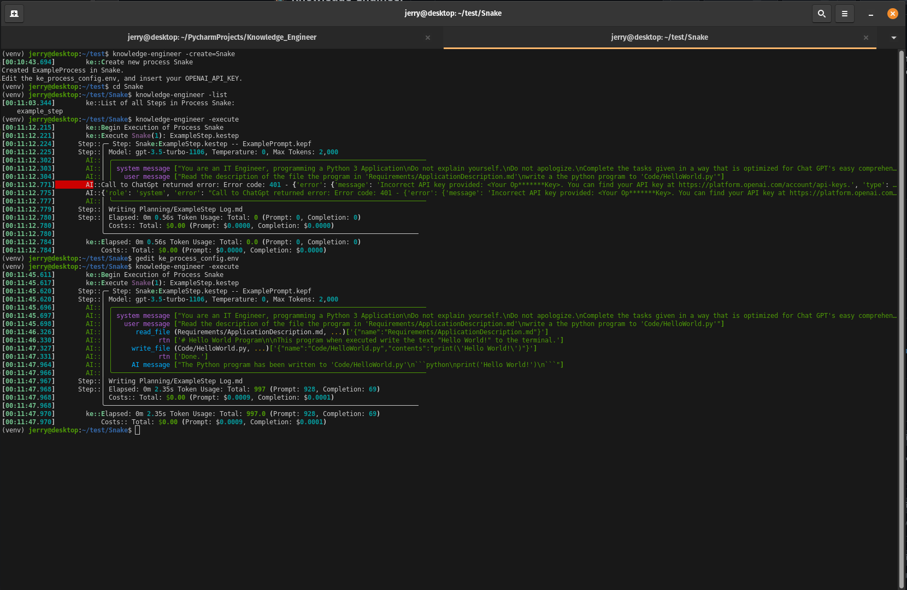

# KnowledgeEngineer

***Command Line Program allowing for the Engineering of Knowledge for Chat-GPT.***

#  Screen Shot

# P.S.
## The project is managed with JetBrains YouTrack, and GitHub
### YouTrack Configuration
- Place Configuration information here...
### GitHub Configuration
- Place Configuration information here...
### Pycharm Integration
- Place Configuration information here...

# Directory Structure of a Process:
All the memory requirements of a process are stored in a single directory.  This directory is the current directory in which the program is run.  The directory is required to have a configuration file named "ke_process_config.env".

### The "ke_process_config.env" file
contents should be:

    KE_PROC_DIR_PROMPTS='Prompts'
    KE_PROC_DIR_STEPS='Process'
    KE_PROC_DIR_REQUIREMENTS='Requirements'
    OPENAI_API_KEY=<Your Open API key>

The first 3 values are the subdirectories where the process stores different value types, 

#### For example 
a Step file called "1- Step One" will be looked for in the directory:

    "./Process/1- Step One.kestep"

# Links and AIDs

[Distribute Python with pip install](How%20to%20Create%20Python%20Packages%20_%20Towards%20Data%20Science.pdf)

